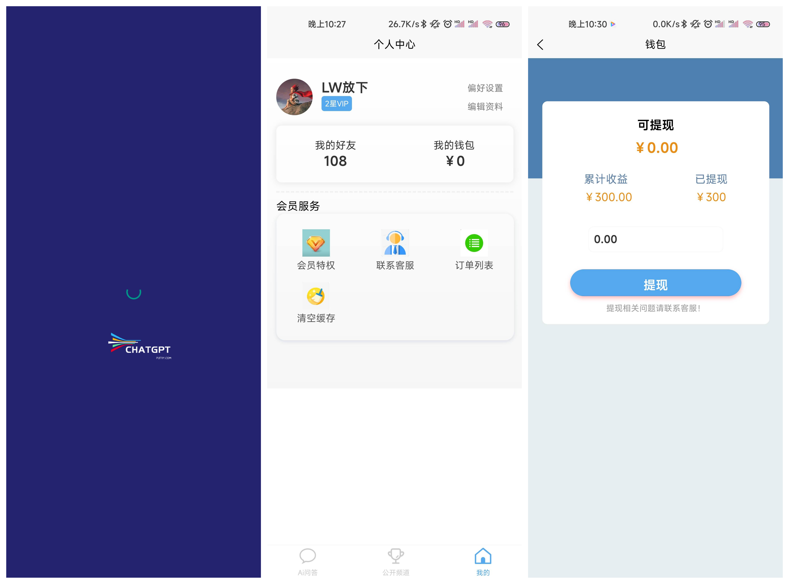
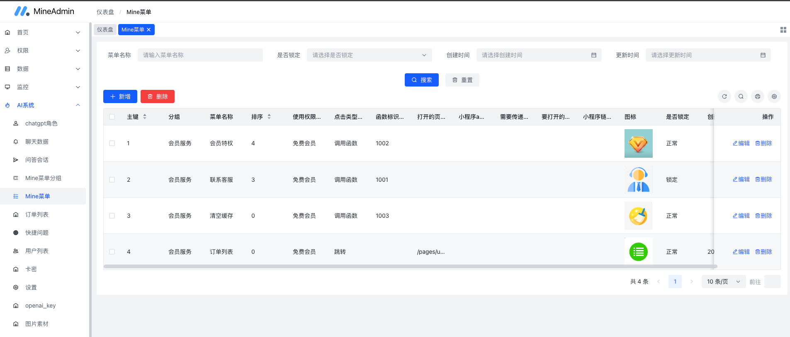

# uniapp、hyperf MineAdmin 实现的 chatgpt应用，支持小程序、H5、App！
## 效果图
#### App



#### 后台系统
.


## 线上体验
##### 注册时账号密码随便填, 邀请码填: 1，这个邀请码就是上级用户ID而已，1为顶级！
#### H5 [http://ai.putyy.com](http://ai.putyy.com)

## 技术栈 具体依赖看项目代码吧！
### 前端
> uniapp vue3 pug scss 等
### 后端
> swoole hyperf MineAdmin 等

## 功能说明
> 客户端： 问答上下文、快捷提问、角色自定义、历史会话、公开频道、模型设置、VIP系统、邀请好友、分佣系统、联系客服、钱包系统、提现、订单、好友管理等

> 后台：chatgpt角色自定义、快捷提问管理、聊天数据管理、个人中心菜单管理、订单管理、用户管理、卡密管理、设置(openai地址、客服信息、用户协议等设置)、图片素材(个人中心banner)、openai_key管理(自动轮训)


## 开始安装
> 下载本项目
```shell
git clone https://github.com/putyy/chatgpt.git
```

## 安装 MineAdmin
#### 1. 按照官方文档进行安装 [安装文档](https://doc.mineadmin.com/guide/install/)

#### 2. 安装好后，打开后台: 工具->模块管理->新增，模块名称: Ai 其他随意， 添加完成后需要启用

#### 3. 安装本项目mineadmin-php
>复制本项目 ./MineAdmin/php/app/ai 下所有子文件夹，粘贴到到mineadmin-php app/ai目录下
>> cp -r ./MineAdmin/php/app/ai/ ./you-mineadmin-php/app/ai

> 执行以下命令添加本项目需要的数据表及初始化数据
>> php bin/hyperf.php mine:migrate-run ai
>>
>> php bin/hyperf.php mine:seeder-run ai
>>
>> php bin/hyperf.php ai:init-menu

> 生成Ai api需要的jwt key
>>php bin/hyperf.php mine:jwt-gen --jwtSecret=JWT_AI_SECRET

> 修改mineadmin后端 jwt 配置文件，位置: config/autoload/jwt.php,新增如下内容:
> ```php
> return [
>     // ......
>     'scene' => [
>          // 新增如下
>          'ai' => [
>             'secret' => env('JWT_AI_SECRET', ''), // 非对称加密使用字符串,请使用自己加密的字符串
>             'login_type' => 'sso',
>             'sso_key' => 'id',
>             'ttl' => 86400,
>             'blacklist_cache_ttl' => 86400, 
>          ],
>          // ......
>     ]
>     // ......
> ]
> ```

> 修改mineadmin后端 route 配置文件，位置: config/routes.php,新增如下内容:
> ```php
> Router::addServer('message', function () {
>    // ......
>    // 新增如下内容
>    Router::get('/ws-chat', 'App\Ai\Api\Websocket', [
>        'middleware' => [  ]
>    ]);
>    // ......
> })
> ```
> 
> 安装composer依赖包
>> composer require easyswoole/oss putyy/php-constants orhanerday/open-ai --ignore-platform-reqs

> 修改mineadmin后端 file 配置文件，位置: config/autoload/file.php,新增如下内容:
> ```php
> return [
>   'storage'=>[
>       'qiniu'=>[
>           // ......
>           'accessKey' => '七牛云accessKey',   
>           'secretKey' => '七牛云secretKey',   
>           'host' => env('QINIU_HOST', '你的七牛云访问主域名,例: baidu.com'),
>           // 具体查看 https://developer.qiniu.com/kodo/1671/region-endpoint-fq
>           'upload_domain' => env('QINIU_UPLOAD_DOMAIN', 'https://up-cn-east-2.qiniup.com'),
>           'image_bucket' => env('QINIU_IMAGE_BUCKET', '七牛云图片空间'),
>           'image_domain' => env('QINIU_IMAGE_DOMAIN', '七牛云图片域名'),
>           // 以下未用到 不用配置
>           'audio_bucket' => env('QINIU_AUDIO_BUCKET'),
>           'video_bucket' => env('QINIU_VIDEO_BUCKET'),
>           'audio_domain' => env('QINIU_AUDIO_DOMAIN'),
>           'video_domain' => env('QINIU_VIDEO_DOMAIN'),
>           // ......
>       ]
>   ]
> ]
>```

> 4. 安装本项目mineadmin-vue
>> 复制本项目 ./MineAdmin/vue/src 下所有子文件夹，粘贴到到mineadmin-vue src目录下
>>> cp -r ./MineAdmin/vue/src/ ./you-mineadmin-vue/src
>>
>> 安装 qiniu-js
>>> yarn add qiniu-js --save
>>
>> 运行
>>> yarn run dev

#### 打开后台系统
> 添加openai api key： Ai系统->openai_key->新增, 返回列表点击顶部刷新缓存
> 
> 设置站点相关信息： Ai系统->设置


### 大功告成，其他功能自行探索！

.
### 安装 uniapp
#### 1. 按照uniapp官方文档安装好环境
#### 2. 用HBuilderX打开本项目UniApp文件夹
#### 3. 按照以下说明修改配置文件(相关文件都在UniApp文件夹内)
> uniapp开发者中心  [点击获取appid](https://dev.dcloud.net.cn/pages/app/list)
```shell
# 修改 ./manifest.json 文件中的appid
{
    "name" : "应用名称",
    "appid" : "你的应用ID",
    "description" : "",
    ......
}

# 复制 ./config.example.ts => ./common/config.ts 文件, 修改对应配置
let config = [
    {
        wsUrl: 'ws://开发环境的域名ws/ws-chat',
        baseURL: 'https://开发环境的域名/api/ai/api/'
    },
     {
         wsUrl: 'ws://线上域名/ws/ws-chat',
         baseURL: 'https://线上域名/api/ai/api/'
    }
]
```
.
#### 4. 安装以下插件(点击打开，页面最右侧导入HBuilderX)，已安装过则忽略
> [uni-ui](https://ext.dcloud.net.cn/plugin?id=55)
> 
> [compile-typescript](https://ext.dcloud.net.cn/plugin?name=compile-typescript) 
> 
> [compile-node-sass](https://ext.dcloud.net.cn/plugin?name=compile-node-sass) 
> 
> [pug-language](https://ext.dcloud.net.cn/plugin?name=pug-language) 
> 
> [compile-pug-cli](https://ext.dcloud.net.cn/plugin?name=compile-pug-cli)

#### 6. HBuilderX最顶部： 运行->运行到浏览器
#### 大功告成！

## 其他
## uniapp打包app、h5、小程序参考uniapp官方文档，使用HBuilderX配置manifest.json 之后进行打包操作！
.
## nginx配置文件可以参考如下
```nginx
# 前端
location / {
  index  index.html index.htm;
  try_files $uri $uri/ /index.html;
}

 # PHP后端代理，这里的 /prod/ 要跟前端 .env.production 的 VITE_APP_PROXY_PREFIX 值一致
location /api/ {
  
  if ($request_method = 'OPTIONS') {
    add_header Access-Control-Allow-Origin *;
    add_header Access-Control-Allow-Methods 'GET, POST, OPTIONS, DELETE';
    add_header Access-Control-Allow-Headers 'DNT,Keep-Alive,User-Agent,Cache-Control,Content-Type,Authorization,X-Token';
    return 204;
  }
  
  # 将客户端的 Host 和 IP 信息一并转发到对应节点
  proxy_set_header Host $http_host;
  proxy_set_header X-Real-IP $remote_addr;
  proxy_set_header X-Forwarded-For $proxy_add_x_forwarded_for;
  # 将协议架构转发到对应节点，如果使用非https请改为http
  proxy_set_header X-scheme https;

  # 执行代理访问真实服务器
  proxy_pass http://127.0.0.1:9501/;
}

location /ws/ {
    # WebSocket Header
    proxy_http_version 1.1;
    proxy_set_header Upgrade websocket;
    proxy_set_header Connection "Upgrade";

    # 将客户端的 Host 和 IP 信息一并转发到对应节点
    proxy_set_header X-Real-IP $remote_addr;
    proxy_set_header X-Forwarded-For $proxy_add_x_forwarded_for;
    proxy_set_header Host $http_host;

    # 客户端与服务端无交互 60s 后自动断开连接，请根据实际业务场景设置
    proxy_read_timeout 60s ;

    # 执行代理访问真实服务器
    proxy_pass http://127.0.0.1:9502/;
}
  
# ^~ 不能去掉，/upload/ 中的 upload 可以改成其他名称
location ^~ /upload/ {
    # 将客户端的 Host 和 IP 信息一并转发到对应节点
    proxy_set_header Host $http_host;
    proxy_set_header X-Real-IP $remote_addr;
    proxy_set_header X-Forwarded-For $proxy_add_x_forwarded_for;
    # 将协议架构转发到对应节点，如果使用非https请改为http
    proxy_set_header X-scheme https;

    # 执行代理访问真实服务器
    proxy_pass http://127.0.0.1:9501/;
}
```
#### MineAdmin-vue下的.env.development文件如下
```env
VITE_APP_BASE_URL = http://you.domain.com/api

VITE_APP_UPLOAD_URL = http://you.domain.com/upload

VITE_APP_WS_URL = ws://you.domain.com/ws/message.io
```

#### uniapp下的./common/config.ts文件如下
```
let config = [
    {
        wsUrl: 'ws://you.domain.com/ws/ws-chat',
        baseURL: 'https://you.domain.com/api/ai/api/'
    },
     {
         wsUrl: 'ws://you.domain.com/ws/ws-chat',
         baseURL: 'https://you.domain.com/api/ai/api/'
    }
]
```
## 免责声明
#### 使用本软件不得用于开发违反国家有关政策的相关软件和应用，若因使用本软件造成的一切法律责任均与本人无关！

